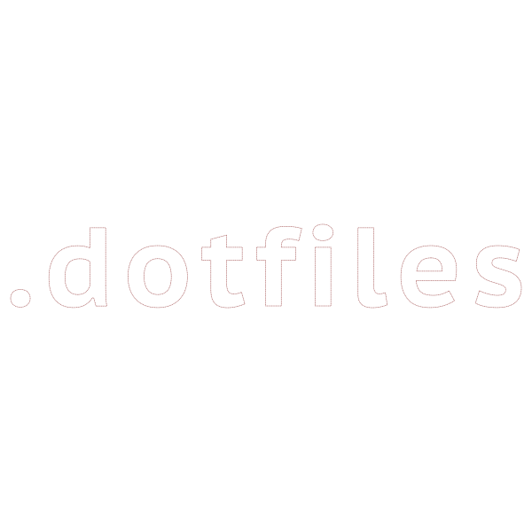

  

    <i>Scripts and dotfiles to set up a new mac without even a single click 😎.</i>

## Description

Hands up if you have spent a full day setting up your fresh new mac installation... we all have been there. No more configuration, app installation and staring at the mac while it get dressed. Run this scripts and let them do the work for you 🎩.

#### Scripts

* **[macos.sh:](https://github.com/albertoqa/dotfiles/blob/master/bin/macos.sh)** Sets up macOS defaults with my preferred config.
* **[dot.sh:](https://github.com/albertoqa/dotfiles/blob/master/bin/dot.sh)** Symlinks dotfiles to the user's home directory.
* **[brew.sh:](https://github.com/albertoqa/dotfiles/blob/master/bin/brew.sh)** Install command-line tools and apps using Homebrew.
* **[appsconfig.sh:](https://github.com/albertoqa/dotfiles/blob/master/bin/appsconfig.sh)** Configure some of the installed apps as Atom, Transmission...

**Notes:**

* `macos.sh` and `brew.sh` will ask you to enter your password several times.
* `brew.sh` takes a while to complete.
* Be sure to restart your computer for all updates to take effect.
* Tested on macOS 10.12 Sierra.

I'm getting a blog post ready to explain in detail the content of each script and dotfile... I will post the link here once it is ready! 📭

   
## Thanks to…

* [Done Martin](https://github.com/donnemartin) and [his dev-setup repository](https://github.com/donnemartin/dev-setup)
* [Mathias Bynens](http://benalman.com/) and his [dotfiles repository](https://github.com/mathiasbynens/dotfiles)
